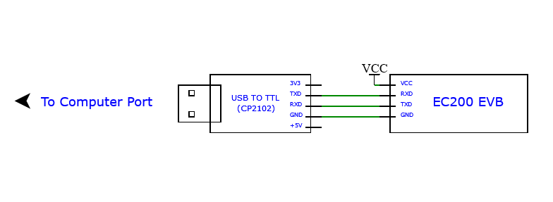

# EC200
In this project, we are going to see how to interface GSM Module(EC200) to USB to TTL(CP2102). So lets get to business!

A GSM(Global System for Mobile Communication) module is used to enable communication between microcontroller or microprocessor and GSM network.<br><br>
You can checkout the [Quectel Website](https://www.quectel.com/) for more details regarding their products.<br><br>
Okay! Now let’s see how to connect a GSM module to USB to TTL(CP2102)!

## Table of Contents
* [Documentation](README.md#documentation)
* [Connection Diagram](README.md#connections)
* [Getting Started](README.md#getting-started)
* [Contributions](README.md#contributions)
## Documentation
It is highly recommended to go through the Documentation first.<br>
Here are direct links for same.<br>
* [Datasheet](https://www.quectel.com/ProductDownload/EC200T.zip) 
* [AT Command Manual](https://www.quectel.com/ProductDownload/EC200T.zip)

## Connections
<p align="center">
  
</p>
* Rx(EC200) ---> Tx(USB to TTL)
* Tx(EC200) ---> Rx(USB to TTL)
* Power Supply(5V/3.3V and GND)
## Getting Started
## Contributions
For reporting any ```technical issue``` or proposing ```new feature```, please create new [issue](https://docs.github.com/en/issues/tracking-your-work-with-issues/creating-an-issue).

